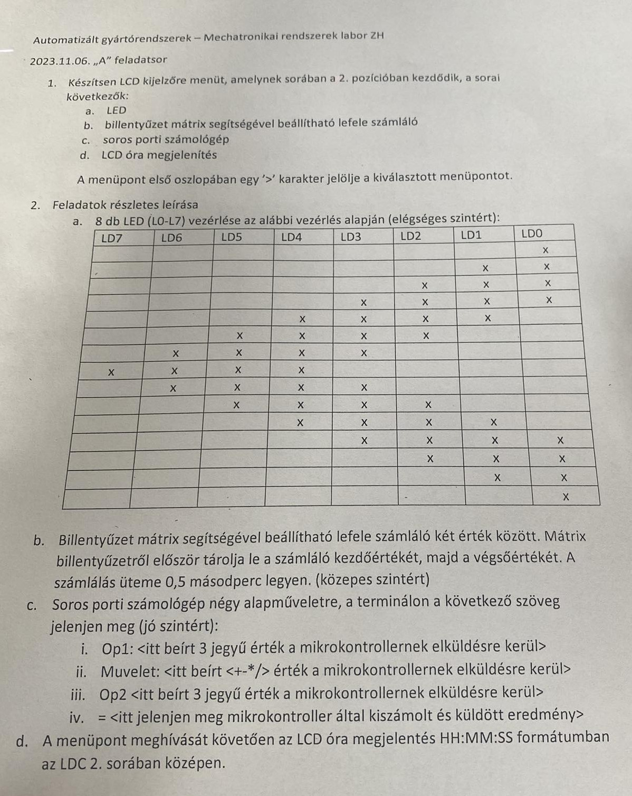
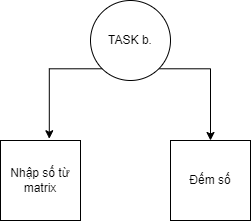
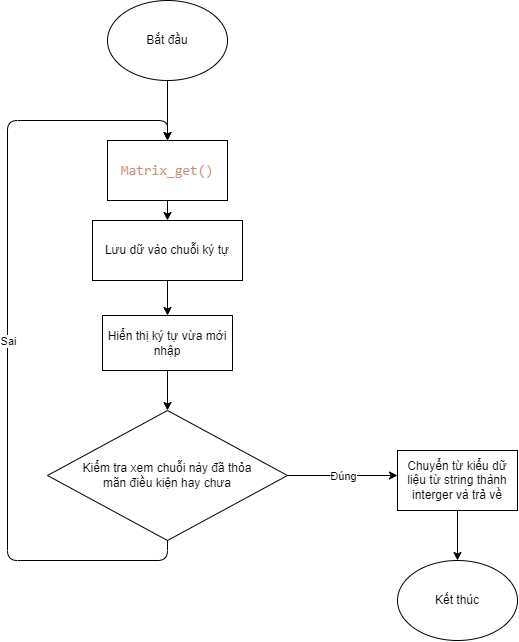

# Hướng dẫn làm bài tập ZH môn Automatizált Gyártórendszerek I labor ngày 2023.11.06
Đề bài:



Nhìn tổng thể ta có thể thấy đề bài được chia làm 5 phần nhỏ, các phần a. b. c. d. và phần menu dùng để lựa chọn một trong 4 trạng thái hoạt động.
Mặc dù đề bài không nói đến nhưng tôi nghĩ mỗi phần nhỏ nên đi kèm hai chức năng là bật và tắt, để tránh sử dụng tài nguyên của uC quá mức khi chạy cùng lúc 2,3 hoặc task.

Chúng ta sẽ lần lượt đi qua từng phần a. b. c. d. trước, và sau đó quay trở lại phần menu sau cùng.

## Phần a.
Phần này tương đối đơn giản, lập trình sao cho 8 led lần lượt sáng theo thứ tự như trong bảng và lặp lại. 

Có hai phương pháp được đề ra để giải quyết những bài như trên:
sử dụng thuật toán và sử dụng bộ nhớ

### Sử dụng thuật toán
```C
void led_run()
{
	static uint16_t origin=0x000F;
	static uint8_t direction=0;// 0:left<-right; 1:left-> right
	led_out(origin<<3);
	if(direction==0)
	{
		origin<<=1;
		if(origin==0x0780)
		{
			direction=1;
		}
	}
	else
	{
		origin>>=1;
		if(origin==0x000F)
		{
			direction=0;
		}	
	}

}
```

### Sử dụng bộ nhớ
``` C
# defind 
const int led_states_len= LED_STATES_LEN;
uint8_t led_states[LED_STATES_LEN]=
{
	0b00000001,
	0b00000011,
	0b00000111,
	0b00001111,
	0b00011110,
	0b00111100,
	0b01111000,
	0b11110000,
	0b01111000,
	0b00111100,
	0b00011110,
	0b00001111,
	0b00000111,
	0b00000011,
	0b00000001
};

void led_run(const uint8_t* states,const int states_len){
	static int counter;
	led_out(states[counter]);
	if(counter==states_len-1)
	{
		counter=0;
	}
	else
	{
		counter++;	
	}
}
```
Nếu theo phương pháp này ta sẽ có hai phần chính, driver và bộ nhớ. Có thể hình dung như đĩa CD và đầu chơi đĩa. Bộ nhớ chính là đĩa CD và driver và đầu đĩa. Khi ta muốn chạy led theo một pattern khác thì chỉ việc thay đổi trong phần bộ nhớ là được rồi. Ta hoàn toàn có thể khai báo phần bộ nhớ như các biến cục bộ, không nhất thiết phải là các biến toàn cục. Đối với phần driver led_run(). Ta chỉ cần để nó vào trong một vòng lặp vô hạn như vòng lặp while() trong hàm main hoặc một ISR() của timer là được.

### Bật-Tắt
Task này hoàn toàn có thể để trong super-loop, nhưng để thỏa mãn điều kiện nhịp độ thì phải sử dụng _sleep_us(). Khiến cho loop bị block không cần thiết, vậy nên phương pháp tối ưu nhất vẫn là sử dụng timer. Đối với task này hoàn toàn có thể sử dụng bất kỳ timer nào tùy thìch. Nhưng tôi nghĩ timer 1 và 3 sẽ là tối ưu nhất. Khi mà chúng ta không phải sử dụng counter trong hàm ISR().

Vậy nếu để bật tắt task này thì ta chỉ cần bật tắt timer là được.

## Phần b.
Yêu cầu: nhập số nhỏ và nhập số lớn thông qua bàn phím matrix. Sau đó đếm từ số nhỏ tới số lớn với nhịp là 0,5s
Nếu phần tích task này thành các task nhỏ hơn thì ta sẽ có 2 phần là:


## Nhập số từ matrix

Đề bài không có yêu cầu gì khác, nhưng để giới hạn thì tôi đặt ra thêm một số yêu cầu phụ:
1. Số nhập vào là số nguyên dương và không quá 4 ký tự
2. Nếu muốn kết thúc việc nhập thì nhấn dấu * 
3. Nhập dấu # sẽ không có tác dụng gì.
4. Để tương tác với người dùng, khi nhập số thì số phải hiện lên màn hình, ở đây chúng ta sẽ sử dụng LCD cụ thể là bắt đầu từ dòng thứ 2.

Cũng như các nút nhấn, để nhận các thông tin đầu vào từ matrix, uC cũng phải liên tục theo dõi các tín hiệu tới từ matrix để phân tích xem người dùng đang nhấn nút gì. Nhờ có sự hỗ trợ của thư viện ```Important file\matrix.h``` thì ta đã giảm tải được phần lớn công việc, bây giờ chỉ cần gọi hàm ```matrix_get()``` trong một vòng lặp tận là được. Lưu ý kiểu dữ liệu trả về của hàm này là ```char```. 

Bản phác họa flowchart của hàm nhập số từ matrix sẽ như thế này(Lưu ý đây chỉ là tham khảo, người đọc có thể thay đổi code sao cho phù hợp)



## Đếm số
Đếm ngược từ số lớn đến số bé và lặp lại.\
Gợi ý: 
- sử dụng timer 0,1 hoặc 3. 
- sử dụng 2 biến toàn cục chứa giá trị của số lớn và số nhỏ.
- hiển thị trên LCD


			
